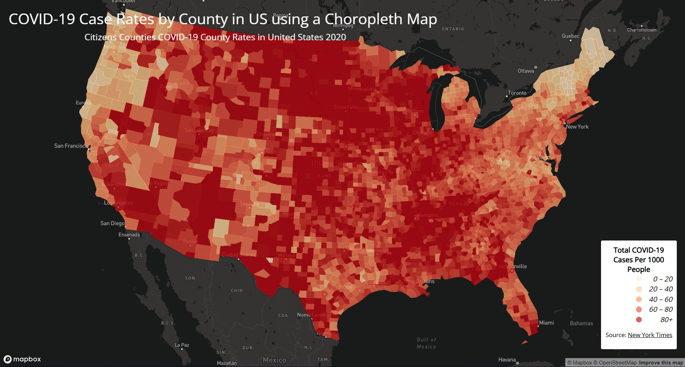
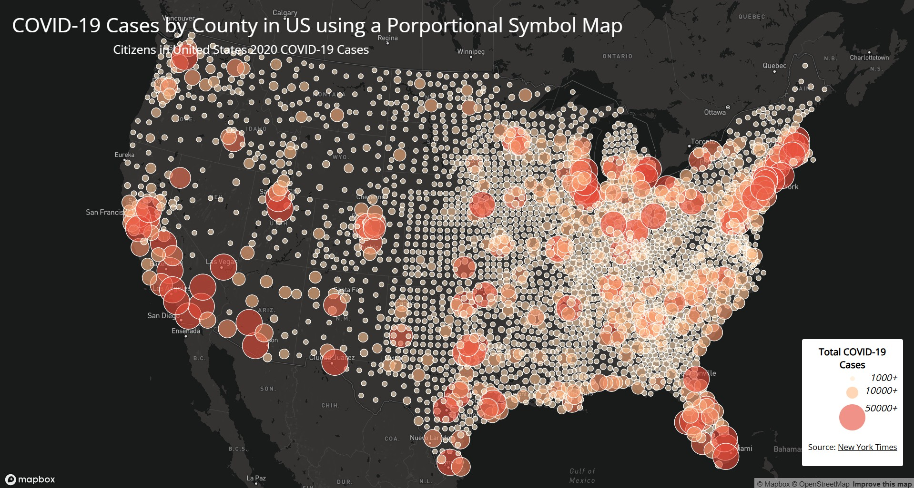

# COVID-19-Maps (Choropleth and Porportional Symbol Map)

## Introduction
This project was created to look at how the COVID-19 cases were spread across the US in relation to counties and locations. We created two maps called map1 and map2. Map 1 showes the COVID-19 Case Rates by County in the US using a choropleth map, and Map 2 showed the total COVID-19 total cases by area on the map using a porportional symbol map. We used HTML, CSS, JS, and Mapbox in order to create these maps. The data was derived from multiple links linked in the supplementary information section. 

## Links To The Maps
[Map-1](https://evanl105.github.io/COVID-19-Maps/map1.html)
[Map-2](https://evanl105.github.io/COVID-19-Maps/map2.html)

## Images/ Screenshots of Maps

## Primary Functions
The primary functions for these images/ maps are to understand what is happening and what the spread of the COVID-19 cases are across the US in relation to counties. This is important because we want to understand which areas were hit the hardest, so if it possibly happens again, we know which area to help/ send aid to. Using this information, we can also send aid even years after the pandemic. We can send help or COVID-19 vaccinese medication to those areas that are prone to COVID-19 cases so we can lower the case amount. We can also use this data to see not only the county but the wider area that was hit the hardest and why. Typically, the areas that hit the hardest are the areas with higher population and/or not enough resources and health care resoruces. This isn't just useful for knowing where COVID-19 cases are, but it can help us understand what areas might need more resources for other diseases or health complications, so we can send more medical resources. Overall, this map can bring light to areas that are in need of help and what areas might not need as much attention.

## Supplementary Information
The libraries we used is the Google Font library in order to change the font to Open Sans and the Map Box libary in order to see and visualize the maps. We reference these libraries in the header of both our HTML files. The data sources we use are us-covid-2020-rates and us-covid-2020-counts, which was orignally zip files, but we extracted and cleaned them using MapShaper. The original data was from [The New York Times](https://github.com/nytimes/covid-19-data/blob/43d32dde2f87bd4dafbb7d23f5d9e878124018b8/live/us-counties.csv), the population data used for calculating the case rate are from the [2018 ACS 5 Year Estimates](https://data.census.gov/cedsci/table?g=0100000US.050000&d=ACS%205-Year%20Estimates%20Data%20Profiles&tid=ACSDP5Y2018.DP05&hidePreview=true), and the US county boundary shapefile was downladed from [The U.S. Census Bureau](https://www.census.gov/geographies/mapping-files/time-series/geo/carto-boundary-file.html). The credit for all the data and information is all linked above. I would also like to refer to the lab 3 walk through instructions for providing the layout for my HTML, CSS, and JS files. I used those layouts and edited them based on the project I was creating and what I wanted to show from the data files. I also searched up examples of how to create legends for choropleth maps because I didn't know how to create legends for them, and the instructions didn't show how specifically for choropleth maps. I then researched examples of how people were using legends for their choropleth maps, and based on how they used and created the legend and what I know from the instructions of the lab, I created and tailored my legend so I can accurate legend for my choropleth map. Overall, the information from the instructions and the lab 3 walk-through helped me create these maps and expand my understanding of Wep Map Applications.

